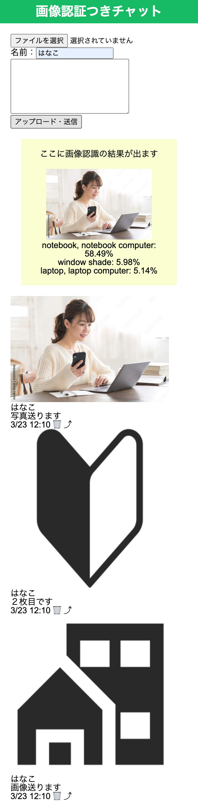

# kadai06-js
JS選手権プロダクト

# ①課題番号-プロダクト名
画像認識月チャット

## ②課題内容（どんな作品か）
- 今考えている事業内容の一つである「画像認識つきコミュニティ」の機能の一部を実装できるようにしました。
## ③DEMO
https://calthydesign.github.io/kadai06-js/

## ④工夫した点・こだわった点
- コピペではあるのですが画像認識を実装できました。
- チャットの基本機能である画像とメッセージ送信も実装することができました。
- 最終的にアプリにしたいのでSPデザインに注力しました

## ④難しかった点・次回トライしたいこと(又は機能)
- 非同期処理の情報をFirebaseに送ることができない問題が解決できず、jsにこだわらず解決できる方法を見つけたいです。
- AIにほぼ頼りきりでコードを書いてしまったので、理解できていないところを徐々に減らしていきたいです。

## ⑤質問・疑問・感想、シェアしたいこと等なんでも
- [質問] 
- [疑問] 
- [感想] 
- [tips] tensorflowの読み方はテンサーフローまたはテンソルフロー
- [参考記事] https://www.tensorflow.org/js/models?hl=ja

- ### おまけ

